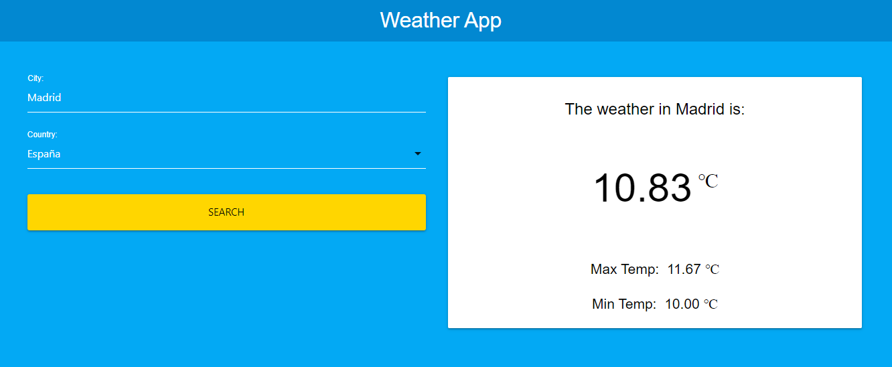

# Weather Forecast App
### Description 💰💸

Simple React project to get the weather forecast by city in some European countries from the OpenWeather API.

## Start the app 🚀

Instructions to get a copy of the working project on your local machine for development and testing purposes.

### Requirements 📋

* Fork this repo.
* Clone this repo.
* npm i && npm start

## DEMO 💻 

LIVE DEMO:

https://weather-forecast-app-react.netlify.app/

## Built with 🛠️

-HTML5
-CSS3
-Materialize CSS
-JavaScript
-React.js
-Open Weather API
-Styled Components
-Netlify
